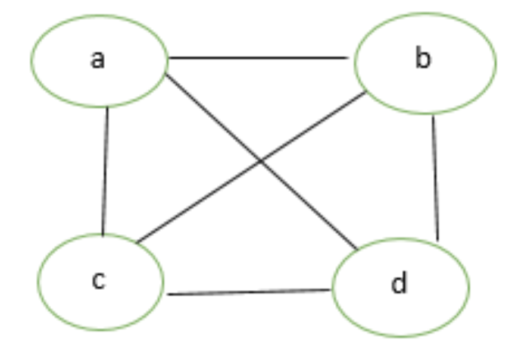
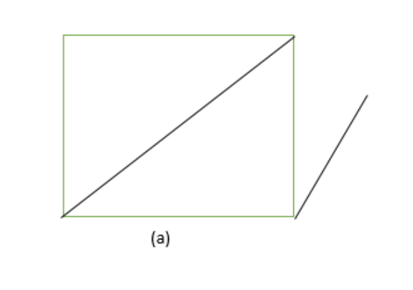
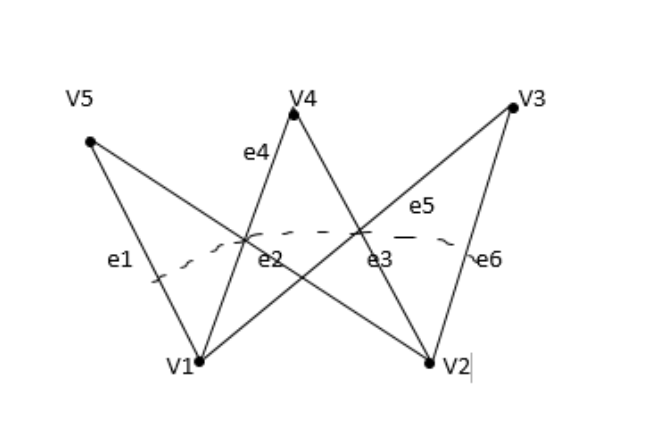
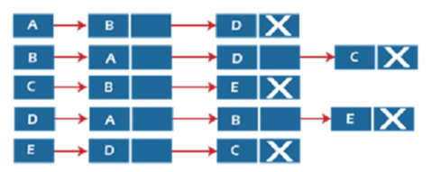
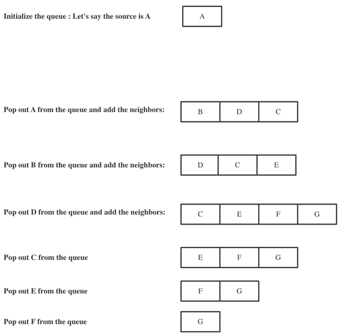
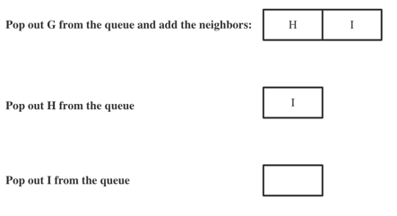
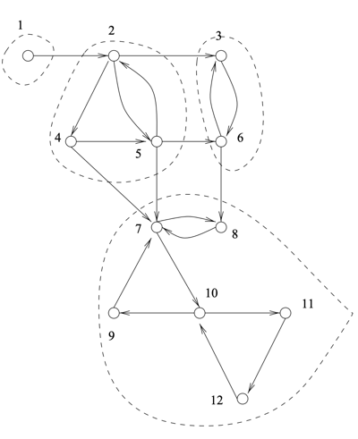

# <center> Synthesis Assignment #2 </center>

---


# <center> CS 5800, Fall 2022 <br /> Dr. Lindsay Jamieson</center>

<br />

<br />

<br />

## Chapter 4: Graphs

### 4.1   Basic Definition

Basically, a graph is a structure composed of vertexes and edges. In computer science, a variety of graphs have been developed. First of all, I'll have a brief introduction about the classes of graphs.

+ ### Types of graphs

  In General, graphs are categorized into 2 types: undirected graphs and directed graphs. Literally, undirected graphs refer to the graphs that are conneted without directed edges while directed graphs are linked with directed edges.
  Basically, all types of graphs are derived from undirected graphs and directed graphs and here are some examples listed below:
+ ### Complete graph

  A graph is a complete graph only when the degrees of each vertex is (n-1), n is the number of verticesimage.



+ Connected or Disconnected Graph#### A connected graph refers to a graph that at least exsists a path between every pair of vertices in the graph. If not, it is a disconnected graph.



+ Cyclic Graph

  A cyclic graph indicates a graph with at leaat one circle.
+ Bipartite Graph

  A bipartite graph means the vertices are grouped into 2 sets of nodes where vertices in the same set are not connceted.



### 4.2   Graph representation

In general, there are 2 basic representations for graphs: one is the adjacency matrix and the other one is the adjacency list.

1. #### Adjacency matrix

   In computer science, adjacency matrixes of graphs are represented in terms of two-dimension arrays where rows and columns represent vertices in the graph and the pair(i,j) represents the connection of two vertices i and j. In this case, if (i,j) == 0, it indicates that there's no edge between node i and node j. Otherwise, if the graph is a weighted graph, then (i,j) will be the weight of the edge between i and j. Here's an example of a un-weighted adjacency list representation for a graph.

---

2. #### Linked list

   The linked list representation of graphs is usually implemented by using linked list structures. In each row, the header of the linked list is the starting node, while the nodes linked to the header are nodes in the graph that connected to the header node. Here's a figure for the linked list representation.



### Exercise

translating a weighted graph from or to an adjacency matrix and list.

the chart for this graph is shown below:


#### Solution:

### 4.3   Graph traversal algorithm

In general, there are two graph traversal algorithm --- breadth first search and depth first search. Each of the seach algorithm can traverse all the nodes in the tree or graph, where the main difference lies in the fact that each one's goal is different.

+ #### BFS algorithm

  Essentially, BFS aims at visiti ng the nodes at a deeper level. Therefore, this algorithm would traverse the graph as deeply as possible until it reaches the "bottom" of the tree(the node that has no un-visited neighnors). Generally, the DFS for graphs are implemented in terms of recursion. The codes in Java listed below can be a very good example.

  The time complexity for the DFS algorithm is O(V + E) while V is the number of vertices and E refers to the number of edges.

```Java
public void depthFirstSearch(Node node) {
    node.visit();
    System.out.print(node.name + " ");
 
    LinkedList<Node> allNeighbors = adjacencyMap.get(node);
    if (allNeighbors == null)
        return;
 
    for (Node neighbor : allNeighbors) {
        if (!neighbor.isVisited())
            depthFirstSearch(neighbor);
    }
}
```

+ #### BFS algorithm

  BFS is short for breadth first search in computer science. Literally, it allows the cursor to traver the nodes with the priority of breadth in the graph. Different from DFS, BFS visit the all neighbors until it jumps into next iteration. And the implementation of the BFS in computer science would prefer the queue to represent the algorithm, since it conforms the FIFO(first in first out) mechanism. Each time when we are visiting a new node,we would pull out the element in the queue and add the neighbors to the queue in order to guarantee all nodes are traversed in a good order. Below is listed some Java implementation of BFS for graphs.


  ````
  void breadthFirstSearch(Node node) {

    // Just so we handle receiving an uninitialized Node, otherwise an
    // exception will be thrown when we try to add it to queue
    if (node == null)
        return;

    // Creating the queue, and adding the first node (step 1)
    LinkedList<Node> queue = new LinkedList<>();
    queue.add(node);

    while (!queue.isEmpty()) {
        Node currentFirst = queue.removeFirst();

        // In some cases we might have added a particular node more than once before
        // actually visiting that node, so we make sure to check and skip that node if we have
        // encountered it before
        if (currentFirst.isVisited())
            continue;

        // Mark the node as visited
        currentFirst.visit();
        System.out.print(currentFirst.name + " ");

        LinkedList<Node> allNeighbors = adjacencyMap.get(currentFirst);

        // We have to check whether the list of neighbors is null before proceeding, otherwise
        // the for-each loop will throw an exception
        if (allNeighbors == null)
            continue;

        for (Node neighbor : allNeighbors) {
            // We only add unvisited neighbors
            if (!neighbor.isVisited()) {
                queue.add(neighbor);
            }
        }
    }
    System.out.println();
  ````

}

````
/*
In some cases, we may traver an unconnected graph with disjointed nodes, If we start with one random node in the graph, we may not be traverse all the nodes.
Therefore, we should use a loop to traverse all the nodes in the graph, even if it's an un-connected one.
*/
void breadthFirstSearchModified(Node node) {
    breadthFirstSearch(node);
 
    for (Node n : adjacencyMap.keySet()) {
        if (!n.isVisited()) {
            breadthFirstSearch(n);
        }
    }
}
````

### Exercise

#### Visit all the nodes in the given graph by using BFS.




### 4.4  Connectivity and strongly connected regions

+ #### Connectivity of graphs

  A connected graph refers to a graph in which there's always a path between every vertex. And the connectivity of a graph denotes a connected graph. On the contrary, dis-connectivity is a graph with disjointed nodes.
+ #### Strongly connected regions

  A Strongly connected region is a part of a graph where every vertex is connected. Here's an example for a strongly connected graph.
  

### Exercise

Run a step-by-step strongly connected component algorithm on the graph given below.

<div align = center>
  
</div>

#### Solution:

Generally, we need to run DFS on the graph twice, and the only difference is that we need to run the first DFS on the reversed graph(all edges in the original graph are reversed).

#### 1. Reverse the graph

<div align = center>
  
</div>

#### 2. Run the first DFS on the given reversed graph

<div align = center>
  
</div>

#### 3. Run the second DFS on the original graph

After execution of DFS, it requires the other DFS on the original graph in descending order of post-visit number.
In this case, the order of implementing DFS on the graph should be : E, D, H, C, G, B, A

+ We start off with E and since there are no edges coming off from E, we end at E.

  In this case, node E is a strongly connected component. Therefore, SSC set = {{E}}

<div align = center>
  

</div>

+ Then we pick the next node -- D and similar to E, we end at D

  In this case, node D is a strongly connected component. Therefore, SSC set = {{E}, {D}}

<div align = center>
  

</div>

+ Next, we start off another SSC at node H, and same as before, we end at node H.

  Therefore, another SSC is added to the SSC set. SSC set = {{E}, {D}, {H}}

<div align = center>
  

</div>

+ Starting off C, and there is an edge C->G. After traversing G, there's no edge coming off, so we end at C.

  Therefore, another SSC is added to the SSC set, SSC set = {{E}, {D}, {H}, {C,G}}

<div align = center>
  

</div>

+ Starting off B, and there is no edge coming off from B.So we end at B.

  Therefore, another SSC is added to the SSC set, SSC set = {{E}, {D}, {H}, {C,G}, {B}}

<div align = center>
  

</div>

+ Finally, we come to the last node in the graph, since all nodes are already visited, we just end at A.

  Therefore, the last SSC is added to the SSC set, SSC set = {{E}, {D}, {H}, {C,G}, {B}, {A}}

## Chapter 5: Graph Algorithms

### 5.1   Dijkstra’s Algorithm

Essentially, Dijkstra's algorithm is a BFS combined with a greedy approach. Initially, all the nodes are added to the queue and in each iteration, the element at the front of the queue is popped out. This can be regarded as a BFS on the graph.

In addition, since we are popping out the node which has the shortest path distance from the source node. Similarly, this approach can be taken as a greed algorithm.

### Exercise

#### Run a step-by-step Dijkstra's algorithm on the given graph below.

<div align = center>
  

</div>

<div align = center>
  

</div>

#### Solution:

Here's the Pseudocode for Dijkstra's algorithm from Dasgupta:

<div align = center>
  
</div>

1. enqueue all the nodes of the graph into the graph.
   H = {A, B, C, D, E, F, G, H, I}.
   <br \>
   Then set the distance of the starting node to be 0, then H would be :
   H = {A = 0, B = INF, C = INF, D = INF, E = INF, F = INF, G = INF, G = INF, H = INF, I = INF}
2. Use a loop to pop out the front node in the queue in each iteration and update all the nodes in the queue.

+ remove A from the H.

  H = {B = 3, D = 4, C = 5, E = 12, F = INF, G = INF, H = INF, I = INF}.<br />
  A : 0
+ remove B from the H.<br />
  A : 0<br />
  B : 3 <br />
  H = { D = 4,C = 5, G = 6, H = 7, E = 12, F = 17, I = INF}.
+ remove D from the H.
  <br />
  A : 0<br />
  B : 3
  <br />
  D : 4<br />
  H = {C = 5, G = 6, H = 7, E = 11, F = 17, I = INF}.
+ remove C from the H.
  <br />
  A : 0<br />
  B : 3
  <br />
  D : 4<br />
  C : 5<br />
  H = {G = 6, H = 7, E = 11, F = 17, I = INF}.
+ remove G from the H.
  <br />
  A : 0<br />
  B : 3
  <br />
  D : 4<br />
  C : 5<br />
  G : 6<br />
  H = {H = 7,  E = 11, F = 17, I = INF}
+ remove H from the H.
  <br />
  A : 0<br />
  B : 3
  <br />
  D : 4<br />
  C : 5<br />
  G : 6<br />
  H : 7<br />
  H = {  E = 11, I = 13, F = 17}
+ remove E from the H.
  <br />
  A : 0<br />
  B : 3
  <br />
  D : 4<br />
  C : 5<br />
  G : 6<br />
  H : 7<br />
  E : 11<br />
  H = { F = 12, I = 13}
+ remove F from the H.
  <br />
  A : 0<br />
  B : 3
  <br />
  D : 4<br />
  C : 5<br />
  G : 6<br />
  H : 7<br />
  E : 11<br />
  F : 12<br />
  H = {I = 13}
+ remove I from the H.
  <br />
  A : 0<br />
  B : 3
  <br />
  D : 4<br />
  C : 5<br />
  G : 6<br />
  H : 7<br />
  E : 11<br />
  F : 12<br />
  I : 13<br />
  H = {}

### 5.2  Bellman-Ford Algorithm

Similar to Dijkstra's algorithm, Bellman-Ford algorithm can also be used for finding the shortest path coming off from the source node in the graph. However, the Dijkstra's algorithm is subject to negative edges in the graph which indicates that if there's at least one negative edge, the Dijkstra's algorithm can no longer apply. Because when one element in the queue is popped out, it is possible that the distance from the source ndoe to the popped-out node can be smaller in the following iteration due to negative edges. And that's how Bellman-Ford kicks in ---- it can not only run on a positive weighted graph, but also on a weighted graph with negative edges. In addition, Bellman-Ford can also detect negative cycles in the graph. Here's the pseudocode for Bellman-Ford algorithm.

<div align = center>
  
</div>

### Exercise

Run a step-by-step execution of Bellman-Ford algorithm on the graph with negative edges given below.

<div align = center>
  

</div>

<br />

Since there are 9 vertices in the graph, there would be 9 - 1 = 8 iterations for traversing all edges in the graph.

<br />

The 1st iteration


| Edge   | Weight |
| -------- | -------- |
| A -> B | 3      |
| A -> C | 5      |
| A -> D | 4      |
| A -> E | -5     |
| B -> F | 14     |
| B -> H | 4      |
| B -> G | 3      |
| C -> G | 7      |
| E -> D | 7      |
| H -> G | 9      |
| H -> I | 6      |
| I -> F | 3      |
| E -> F | 1      |


|   | A | B | C | D | E  | F  | G | H | I  |
| --- | --- | --- | --- | --- | ---- | ---- | --- | --- | ---- |
| d | 0 | 3 | 5 | 2 | -5 | -4 | 6 | 7 | 13 |

The 2nd iteration


| Edge   | Weight |
| -------- | -------- |
| A -> B | 3      |
| A -> C | 5      |
| A -> D | 4      |
| A -> E | -5     |
| B -> F | 14     |
| B -> H | 4      |
| B -> G | 3      |
| C -> G | 7      |
| E -> D | 7      |
| H -> G | 9      |
| H -> I | 6      |
| I -> F | 3      |
| E -> F | 1      |


|   | A | B | C | D | E  | F  | G | H | I  |
| --- | --- | --- | --- | --- | ---- | ---- | --- | --- | ---- |
| d | 0 | 3 | 5 | 2 | -5 | -4 | 6 | 7 | 13 |

Since all nodes are not uodated in the 2nd iteration, we can terminate the loop ahead of time. And the final answer is {B = 3, C = 5, D = 2, E = -5, F = -4, G = 6, H = 7, I = 13}

### 5.3  Subset Parameters (Matchings and Domination)

+ #### Matchings

In computer science, a matching is a set of edges of a graph that shares no common vertex.
In the graph given below，the matching is : {BD, AC}

<div align = center>
  

</div>

<br />

In addition, the maximal matching refers to the matching where no more edges can be added to the set. And the maximum matching refers to the matching where the number of edges or the weight of edges in total is the largest one.

+ #### Dominating set

Before we get to know that is a dominating set, we are supposed to understand what dominate means first. A vertex actually dominates itself and its neighbors. In this case, a dominating set of a graph means all nodes in the graph are dominated by nodes in the dominating set.
Similarly, a minimal dominating set is a dominating set that has the minimal number of vertices. For example, the minimal dominating set for the graph given below is S = {B, E}

<div align = center>
  

</div>

### Exercise

Find a minimal dominating set on the graph given below.

<div align = center>
  

</div>

#### Solution:

First, we need to initialize a queue in which the node contains all the edges coming off from it. Then, we set up a loop and pop out the ndoe with the most number of edges from the queue and update the nodes in the set(edges connected to nodes that are dominated by the popped-out node would be removed from the set)

Here's a step-by-step exmaple for this graph:


| Node | Edge                                   |
| ------ | ---------------------------------------- |
| E    | E -> F, E -> I, E -> D, E -> C, E -> G |
| A    | A -> D, A -> B                         |
| D    | D -> A, D -> C, D -> F                 |
| C    | C -> D, C -> B, C -> E                 |
| B    | B -> A, B -> C                         |
| F    | F -> D                                 |
| D    | D -> A, D -> F, D -> C                 |
| I    | I -> E                                 |
| G    | G -> E, G -> H                         |
| H    | H -> G                                 |

First, we pick E from the queue, then the queue would be :


| Node | Edge                   |
| ------ | ------------------------ |
| A    | A -> D, A -> B         |
| B    | B -> A, B -> C, B -> D |
| F    |                        |
| H    |                        |

Next, pick A from the queue, then the queue would be:


| Node | Edge |
| ------ | ------ |

| F | |
| H | |

And pop out F and H out from the queue.

Therefore, the minimal dominating set is {F, H, A, E}

## Chapter 6: Greedy algorithms

### 6.1   Tecnique Definition
In computer science, greedy algorithms only focus on the optimal solution at the moment without worrying about the future consequences. In other words, greedy algorithms can not always guarantee an optimal solution but only locally optimization.

Dijkstra's algorithm can be a compelling example for greedy algorithms. In each iteration of the loop, the node with the minimal distance from the source node is popped out from the queue. Since each time we are picking a element that is optimal at the moment, it perfectltly meets the requirement of the greedy algorithms.

### 6.2 Minimal spanning tree
Before we get to know what is a minimal spanning tree, we need to understand what a spanning tree is. In computer science, a spanning tree of a graph G is a tree that contains all the vertices of G. In this case, we can deduce that a minimal spanning tree is a tree that contains all vertices of a graph  with the minimal edge weight. Here's an example for a minimal spanning tree of a graph.


<center class = "MST">
  
  
</center>

### 6.3 Kruskal's algorithm
In Kruskal's algorithm, all the edges would be put into a priority queue based on the weight of edges and all vertives would be initialized as an independent set in a large set. Then in each iteration, the edge with the least weight would be popped out from the queue and we must figure out weight the ending points of the edge are in the same set, and if not we merge them into the same set, and put the edge into the answer set.

In this algorithm, the nodes in the same set denote that they are already connected and therefore if one of the node in the edge turns out to be in the same set with the other one, it indicates that this edge is not necessary for building a minimal spanning tree. Here is the pseudocode for Kruskal's algorithm from Dasgupta's book.


<div align = center>
  
</div>


### 6.3 Prim's algorithm
If we look at the pseudocode of the Prim's algorithm, we may find out that it is closely similar to the Dijkstra's algorithm. The only difference is that the Prim's algorithm does not traverse all the edges in the graph while Dijkstra's does so. Obviously, this is a greedy aprroach since each time we are extracting the node with the least distance from the source node. The pseudocode for this algorithm is listed below.

<div align = center>
  
</div>


#### Exercise: Run a step-by-step execution to find a MST in the graph given below

<div align = center>
  
</div>


#### Solution1(Kruskal's algorithm): 

1. Initializa a set which contains a bunch of set with independent nodes in the graph. And put all edges into a edge set E and set the answer set X as null.

    S = {{A}, {B}, {C}, {D}, {E}, {F}, {G}, {H}, {I}}
    
    X = {}
    
    E = {{A->E}, {A->D}, {A->B}, {B->G}, {F->I}, {E->F}, {B->H}, {A->C}, {H->I}, {G->C}, {D->E}, {G->H}, {B->F}}

2. Pop out each edge in E, in a increasing order of weight. And if the ending points of the edge don't exist in the same set, add the edge to X, and merge u,v to the same set.
   
   Here's the step-by-step approach for this:


  + u = A, v = E 
  
  
     S = {{A,E}, {B}, {C}, {D},{F}, {G}, {H}, {I}}

     E = {A->D}, {A->B}, {B->G}, {F->I}, {E->F}, {B->H}, {A->C}, {H->I}, {G->C}, {D->E}, {G->H}, {B->F}}

     X = {AE}

  + u = A, v = D


     S = {{A,E,D}, {B}, {C}, {F}, {G}, {H}, {I}}

     E = {{A->B}, {B->G}, {F->I}, {E->F}, {B->H}, {A->C}, {H->I}, {G->C}, {D->E}, {G->H}, {B->F}}

     X = {AE, AD}
  
  + u = A, v = B
  
     S = {{A,E,D,B}, {C}, {F}, {G}, {H}, {I}}

     E = {{B->G}, {F->I}, {E->F}, {B->H}, {A->C}, {H->I}, {G->C}, {D->E}, {G->H}, {B->F}}

     X = {AE, AD, AB}

   + u = B, v = G

     S = {{A,E,D,B,G}, {C}, {F}, {H}, {I}}

     E = {{F->I}, {E->F}, {B->H}, {A->C}, {H->I}, {G->C}, {D->E}, {G->H}, {B->F}}

     X = {AE, AD, AB, BG}

  + u = F, v = I
     
     S = {{A,E,D,B,G}, {C}, {F, I}, {H}}

     E = {{E->F}, {B->H}, {A->C}, {H->I}, {G->C}, {D->E}, {G->H}, {B->F}}

     X = {AE, AD, AB, BG, FI}

  + u = E, v = F

     S = {{A,E,D,B,G,F,I}, {H}, {C}}

     E = {{B->H}, {A->C}, {H->I}, {G->C}, {D->E}, {G->H}, {B->F}}

     X = {AE, AD, AB, BG, FI, EF}
  
  + u = B, v = H

     S = {{A,E,D,B,G,F,I,H}, {C}}

     E = {{A->C}, {H->I}, {G->C}, {D->E}, {G->H}, {B->F}}

     X = {AE, AD, AB, BG, FI, EF, BH}


  + u = A, v = C

     S = {{A,E,D,B,G,F,I,H,C}}

     E = {{H->I}, {G->C}, {D->E}, {G->H}, {B->F}}

     X = {AE, AD, AB, BG, FI, EF, BH, AC}
  

     Therefore, the minimal spanning tree is composed of AE, AD, AB, BG, FI, EF, BH, AC
     

<div align = center>
  
</div>

#### Solution2(Prim's algorithm): 


1. Initialize a priority queue which contains the cost of node with the distance from the source node and set all nodes as INF except the source node.
   
   
   
2. Set the cost of the source node A to be 0

    PQ = {A = 0, the rest = INF}
3. Delete the smallest element in the queue and update the costs in the queue in each iteration

    
    
    Here's the step-by-step approach for this:

  + v = A, cost(D), cost(E), cost(B), cost(C) are updated


    PQ = {E = -5, D = 1, B = 3, C = 5, F = INF, G = INF, H = INF, I = INF}
  
  + v = E, cost(F) is updated, pre(E) = A

    PQ = {F = -1, D = 1, B = 3, C = 5, G = INF, H = INF, I = INF}

  + v = F, cost(I) is updated, pre(F) = E

    PQ = {D = 1, I = 2, B = 3, C = 5, G = INF, H = INF}

  + v = D, nothing is updated, pre(D) = A

    PQ = {I = 2, B = 3, C = 5, G = INF, H = INF}

  + v = I, cost(H) is updated, pre(I) = F

    PQ = {B = 3, C = 5, H = 8, G = INF}

  + v = B, cost(H) is updated, cost(G) is updated, pre(B) = A

    PQ = {C = 5, G = 6, H = 7}

  + v = C, nothing is updated, pre(C) = A

    PQ = {G = 6, H = 7}
  
  + v = G, nothing is updated, pre(G) = B

    PQ = {H = 7}
  
  + v = H, nothing is updated, pre(H) = B

    PQ = {} 

  So the answer is AE, EF, AD, FI, AB, AC, BG, BH, and the answer is exacly the same as what we did with Kruskal's algorithm.
  

  


   
     
